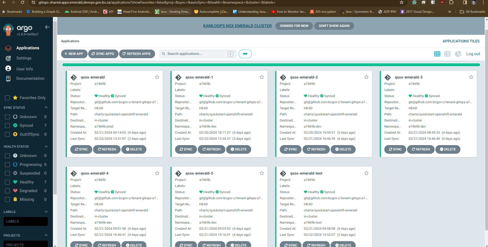

# QuickStart for OpenShift Emerald

## Pull Request-Based Workflows with Sample Stack Targeted for Emerald Cluster

### This repository is addon to [QuickStart for OpenShift](https://github.com/bcgov/quickstart-openshift) and is targeted for Emerald Cluster, with some additional features and configurations.

Additional config/features to make Quickstart OpenShift Emerald Cluster Compatible include:
- ArgoCD for GitOps (Since GHA is not open for Emerald, ArgoCD is used to Deploy the application)
- HELM charts for application deployments reside in bcgov-c organization.
- Sample HELM repo which holds the charts for the application deployments [Here](https://github.com/bcgov-c/tenant-gitops-a7469b). 
- Follow this link to see the [ArgoCD Setup](https://docs.developer.gov.bc.ca/argo-cd-usage/)
- Emerald is closed by nature for any traffic, teams must define explicit KNP and Ingress rules to allow traffic to the application.
- Teams must understand Security Constraints when using Emerald Cluster and apply it appropriately to each component. Follow this link(IDIR protected) to learn details around Emerald cluster [Here](https://digital.gov.bc.ca/cloud/services/private/internal-resources/emerald/)

Limitations:
- GitHub Actions is not available for Emerald Cluster, so ArgoCD is used for GitOps.
- Since Argo Depends on pre-defined HELM charts, the PR pipeline is  tweaked with MOD 5 to allow 5 concurrent PRs to be deployed to the cluster.
- ScreenShot below.
- If team needs more, then depending on available resources in the cluster, the MOD can be increased to 10 to do 10 concurrent PR deployments. 
- Currently, the ArgoCD is polling the tenant repos every 3 minutes for changes, so the changes will be reflected in the cluster within 3 to 6 minutes of the PR creation or main merge.
### Resources
This repository is provided by NRIDS Architecture and Forestry Digital Services, courtesy of the Government of British Columbia.

* NRID's [Kickstarter Guide](https://bcgov.github.io/nr-architecture-patterns-library/docs/Agile%20Team%20Kickstarter) (via. Confluence, links may be internal)

